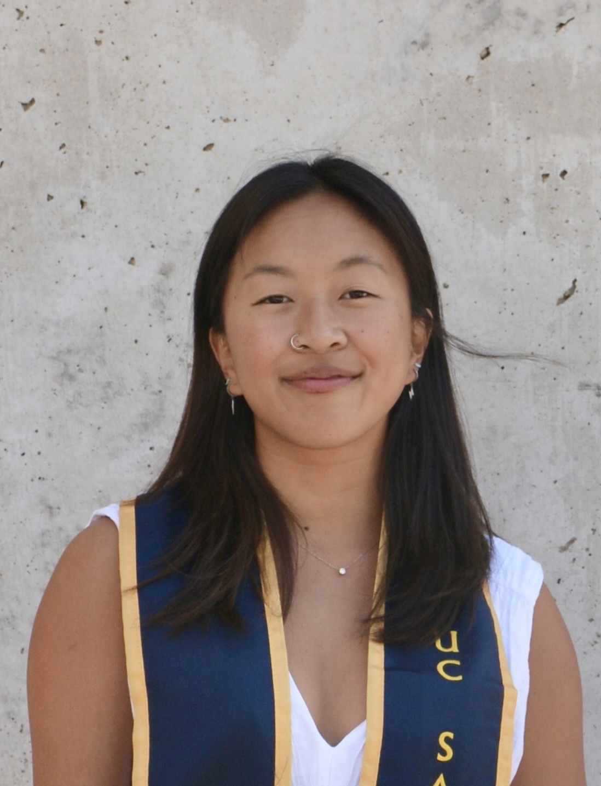

Welcome! 

My name is Ella Say. I am currently a full-time research assistant in the Giocomo Lab at Stanford Univeristy. I use two-photon in vivo calcium imaging paired with virtual reality to study dynamics of hippocampal neurons during navigation and social behavior. 

Previously, I worked as an undergraduate researcher in the Tye Lab at the Salk Institute for Biological Studies where I studied the mechanisms underlying physical and social pain. 

I graduated from UC San Diego in 2024 with a B.S. in Bioinformatics and Computer Science. During my time, I was awarded the Louis Stokes Alliance for Minority Participation to fund my research. I also competed on the UCSD Triathlon Team. 

My current career goal is to start a Neuroscience PhD in Fall 2026. My research interests include: spatial navigation, internal states, population dynamics, decoding of social behavior, metabolism of cognition, and engrams. I am passionate about inclusion in STEM and creating equitable access for all communities. 

Outside of lab, I can be found surfing, trail running, playing the guitar and making banana bread. 

  

