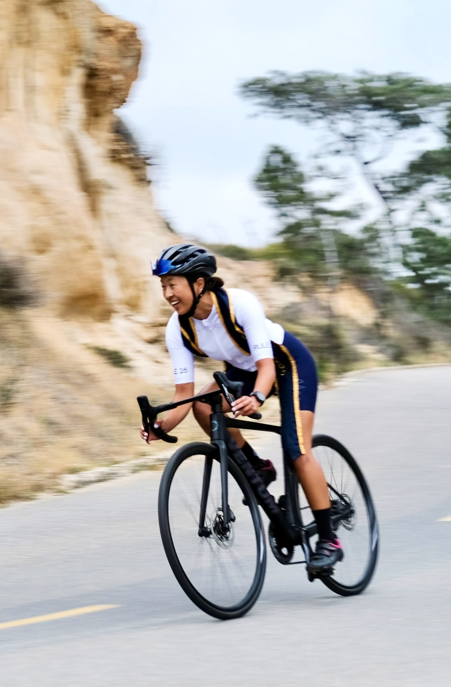
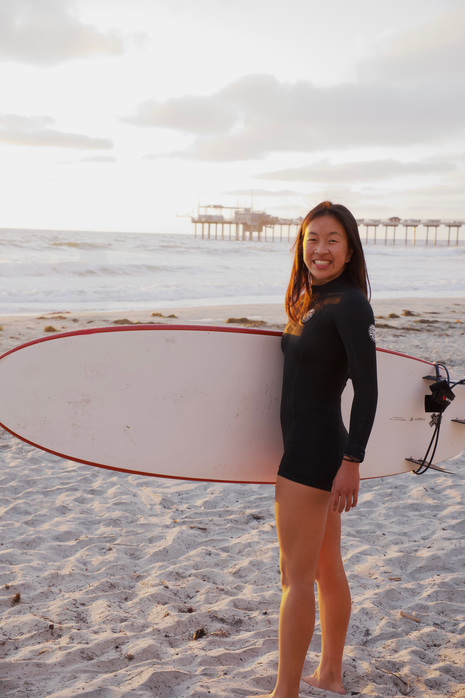

Welcome! 

I am a full-time research assistant in the [Giocomo Lab](https://giocomolab.weebly.com) at Stanford University. I use two-photon *in vivo* calcium imaging paired with virtual reality to study hippocampal neuron dynamics during navigation and social behavior. 

I graduated from UC San Diego in 2024 with a B.S. in Bioinformatics and Computer Science. I was awarded the Louis Stokes Alliance Grant to fund my research on insular representations of physical and social pain in the [Tye Lab](https://tyelab.org) at the Salk Institute for Biological Studies. 

I aim to leverage these experiences and continue my research by pursing a PhD in Neuroscience starting Fall 2026. 

A California girl, born-and-raised, I can often be found surfing, trail running, riding my bike or making banana bread. 

 

  

  

  

