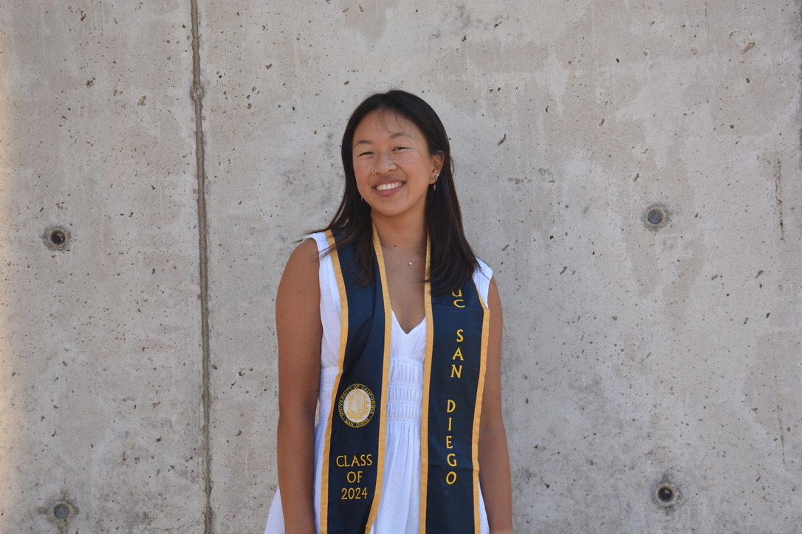

Welcome! 

I am a full-time research assistant in the [Giocomo Lab](https://giocomolab.weebly.com) at Stanford University. I use two-photon *in vivo* calcium imaging paired with virtual reality to study hippocampal neuron dynamics during navigation and social behavior. 

I graduated from UC San Diego in 2024 with a B.S. in Bioinformatics and Computer Science. During my undergrad, I was awarded the Louis Stokes Alliance Grant to fund my research on [insular representations of physical and social pain](https://www.biorxiv.org/content/10.1101/2025.05.09.653162v1) in the [Tye Lab](https://tyelab.org) at the Salk Institute for Biological Studies. 

I care deeply about accessibility for underrepresented groups in STEM and am an advocate for open science communication. I aim to leverage these experiences and continue my research by pursing a PhD in Neuroscience starting Fall 2026. 

 

  

