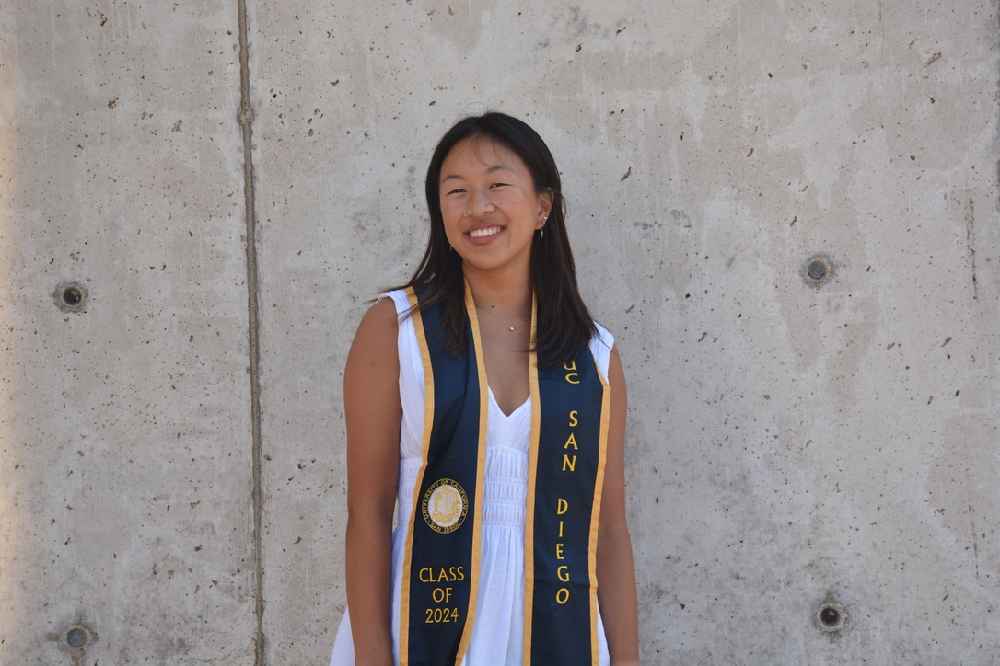

Welcome! 

I am a full-time research assistant in the [Giocomo Lab](https://giocomolab.weebly.com) at Stanford University. I use two-photon *in vivo* calcium imaging paired with virtual reality to study hippocampal neuron dynamics during [navigation] (https://www.cell.com/neuron/fulltext/S0896-6273(26)00170-4) and social behavior. 

I graduated from UC San Diego in 2024 with a B.S. in Bioinformatics and Computer Science. During my undergrad, I was awarded the NSF-funded Louis Stokes Alliance Grant to support my research on [insular representations of physical and social pain](https://www.biorxiv.org/content/10.1101/2025.05.09.653162v1) in the [Tye Lab](https://tyelab.org) at the Salk Institute for Biological Studies. 

I plan to start my PhD in Neuroscience at the University of Washington in Fall 2026, supported by the NSF Graduate Research Fellowship. 

 

  

