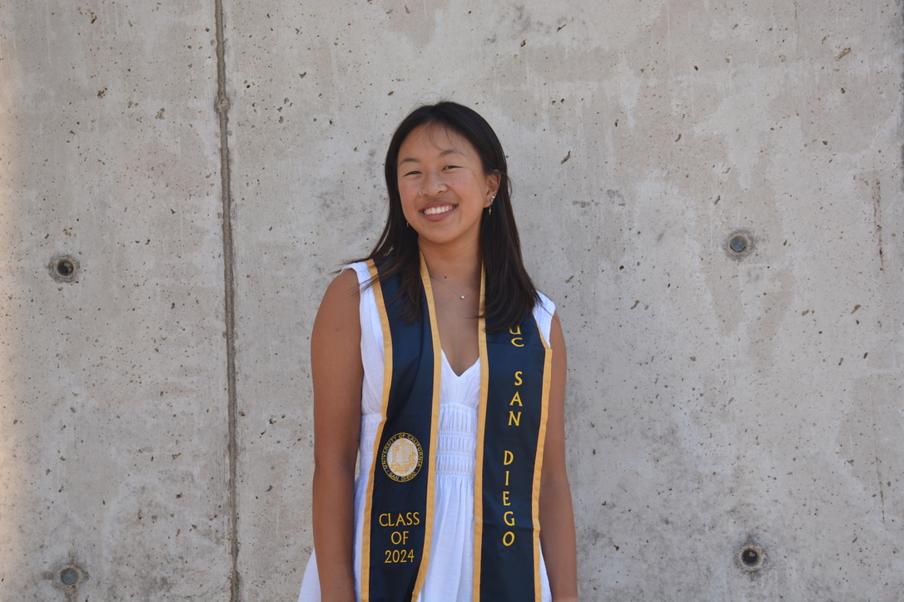

Welcome! 

I am first-year Neuroscience PhD student at the University of Washington, supported by an NSF Graduate Research Fellowship. I am interested in studying learning and memory on a brain-wide and population scale using systems and computational techniques. 

Prior to UW, I worked as a full-time research assistant in the [Giocomo Lab](https://giocomolab.weebly.com) at Stanford University. I studied [hippocampal neuron dynamics during navigation](https://www.cell.com/neuron/fulltext/S0896-6273(26)00170-4) and social behavior. 

I graduated from UC San Diego with a B.S. in Bioinformatics and Computer Science. During my undergrad, I conducted research on [insular representations of physical and social pain](https://www.biorxiv.org/content/10.1101/2025.05.09.653162v1) in the [Tye Lab](https://tyelab.org) at the Salk Institute for Biological Studies. 

I am an avid [triathlete, cyclist, and trail runner](https://www.strava.com/athletes/78348760). 

 

  

